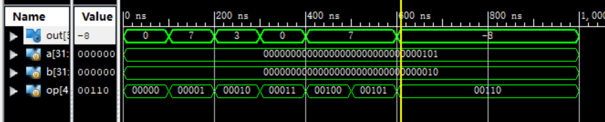
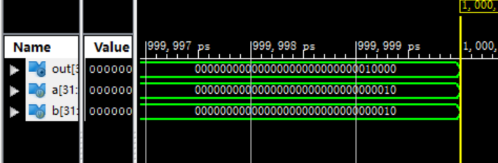
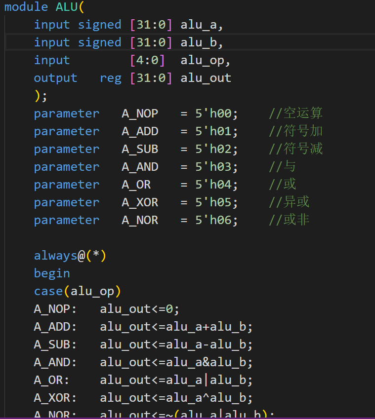
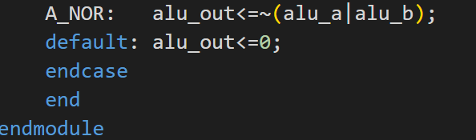
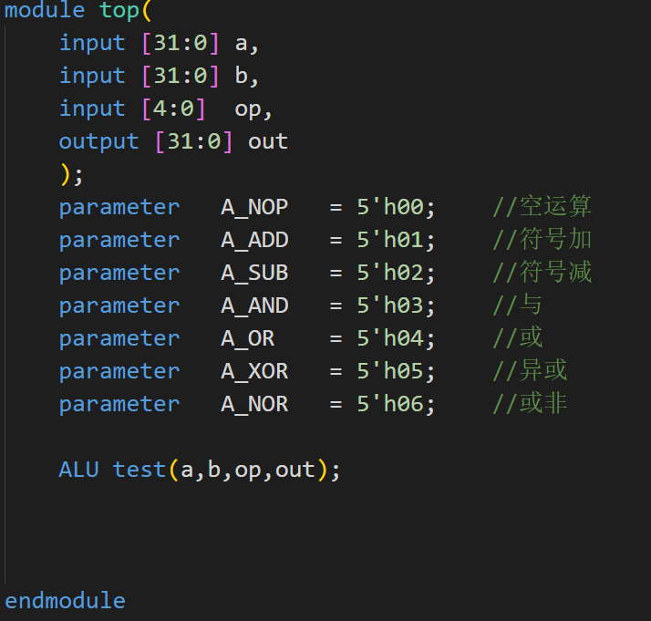
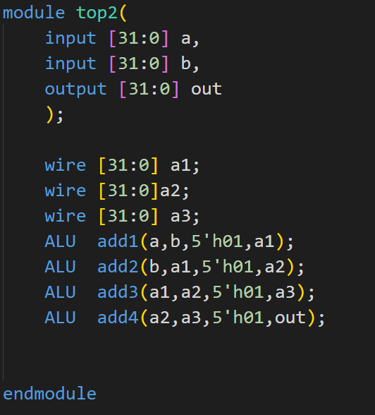

# Lab1 设计运算器部件ALU

## 实验内容

采用组合逻辑，设计32bit位宽运算器；

具体运算功能有：

- NOP(空运算)
- ADD
- SUB
- AND
- OR
- XOR
- NOR

## 实验目的：熟悉利用组合逻辑设计基本运算单元

## 实验要求： 设计ALU模块，例化模块进行费波拉契数列计算

## 实验结果：仿真波形如下图

## 实验代码

### alu.v

### top.v

### top2.v

## 实验总结

ALU的设计只利用了组合逻辑，根据运算操作符做赋值运算即可
