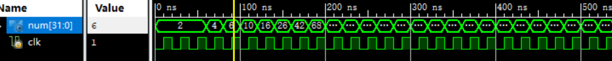
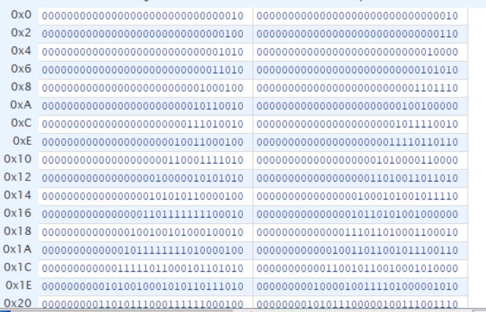

# Lab2 寄存器文件

## 实验内容
 设计一个64个32bit的寄存器文件，单输入输出端，带输入使能。

 端口要求：

```v
 module REG_FILE(
   input	clk,
   input	rst_n,
   input [4:0]	rAddr,
   output [31:0]  rDout,
   input  [4:0]	  wAddr,
   input  [31:0]  wDin,
   input	 wEna,
);
```
## 实验目的

熟悉寄存器文件，利用时钟控制计算

## 实验结果

仿真波形以及运算后的寄存器文件的内容





### 实验代码

#### 寄存器文件

```v
module REG_FILE(
    input	clk,
    input   rst_n,
    input	[5:0]	  rAddr,
    output  [31:0]	  rDout,
    input	[5:0]	  wAddr,
    input	[31:0]    wDin,
    input			  wEna
    );
    integer i;
    reg [31:0] regfile [0:63];
    initial
     begin
       regfile[0]=2;
       regfile[1]=2;
     end
    assign rDout = regfile[rAddr];
    always@(negedge clk,negedge rst_n)
      begin
        if(~rst_n)
          begin
             regfile[0]<=2;
             regfile[1]<=2;
             for(i=2;i<64;i=i+1)
              begin
                regfile[i]<=0;
              end
          end
        else if(wEna)
         begin
          regfile[wAddr]<=wDin;
         end   
      end
endmodule
```
没有读使能，始终可读，有写使能，写使能为高电平时可写寄存器文件

ALU与实验1相同

top模块

```v
module top(
    input clk,
    output [31:0] num
    );
    reg [31:0] calreg1,calreg2;
    wire [31:0] calreg3;
    reg [5:0] readAddr,cnt;
    //reg [1:0] flag;
    initial
     begin
       readAddr = 0;
       cnt = 0;
       calreg1 = 2;
       calreg2 = 2;
     end
     always@(negedge clk)
      begin
       if(cnt == 63)
        begin
          readAddr<=cnt;
          cnt<=cnt;
        end 
       else if (cnt==0) begin
           readAddr<=0;
           cnt<=cnt+1;
       end 
       else
        begin
          cnt<=cnt+1;
          readAddr<=readAddr+1;
          calreg1<=calreg2;
          calreg2<=calreg3;
        end
      end
    

     alu ALU(calreg1,calreg2,5'h01,calreg3);
     REG_FILE myreg(clk,1'b1,readAddr,num,cnt,calreg2,1'b1);
endmodule
```

每周期向寄存器文件中写入一个数，每周期从寄存器文件中输出num，到第64周期，控制变量cnt不再变化。