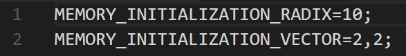
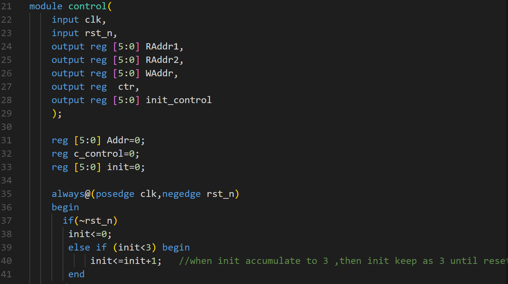
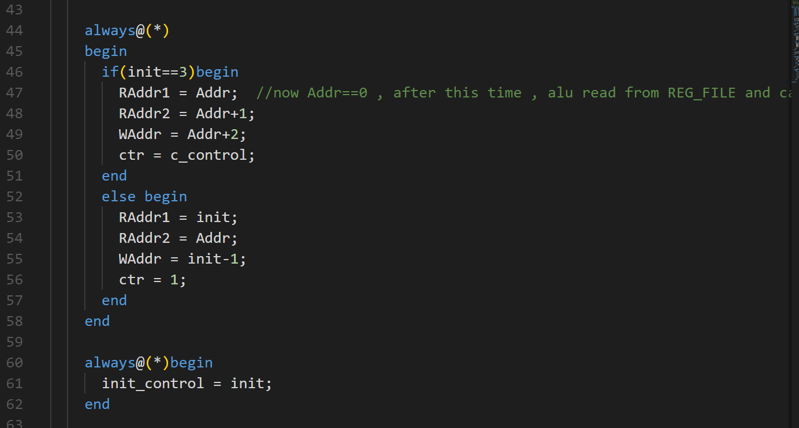
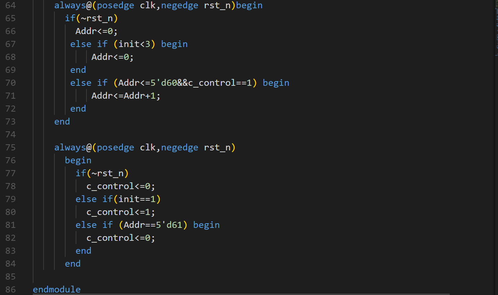
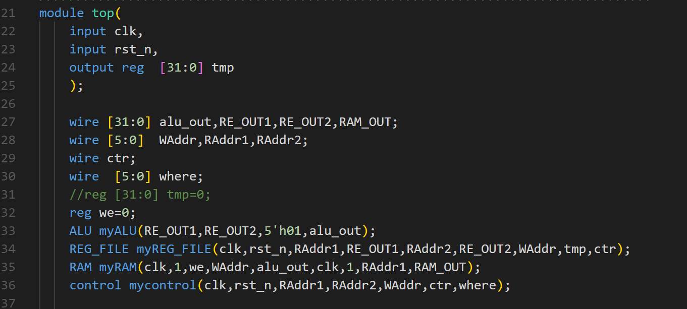
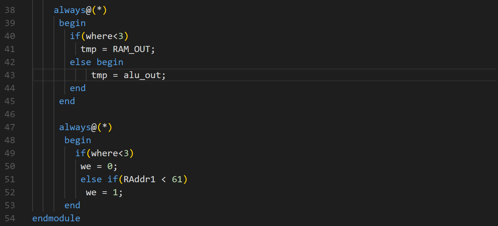
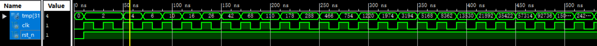
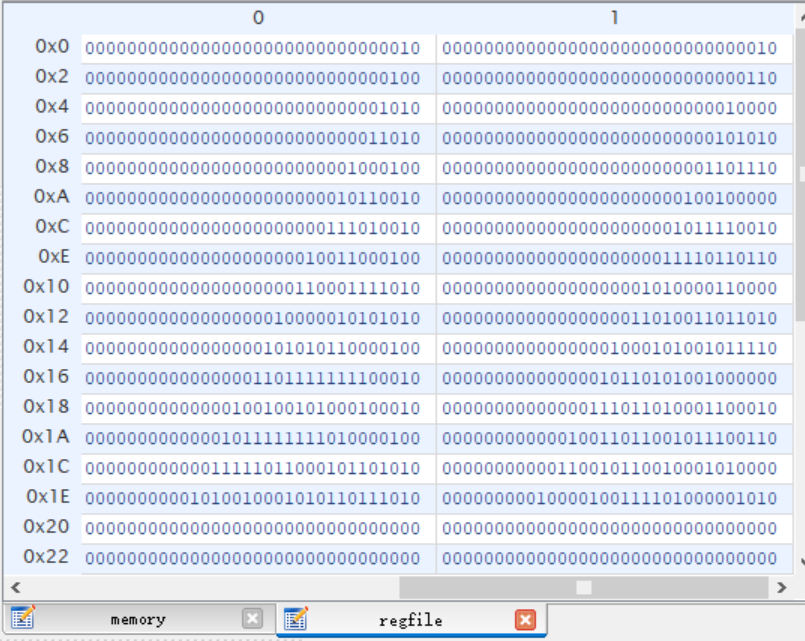
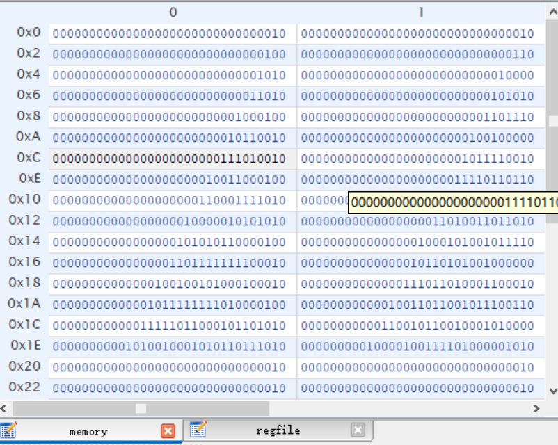

# Lab3 RAM存储器的使用

## 实验目的

- 学习使用ISE的Ip核

- 学习使用Xilinx FPGA的RAM资源
  - 例化一个简单双端口RAM
  - 使用coe文件对RAM进行初始化

## 实验内容

利用coe文件把RAM的前两个单元初始化为2

coe文件截图如下：

初始化或者复位之后的开始阶段，从RAM[0]和RAM[1]中读出数放到REG_FILE[0]和REG_FILR[1]中，但是这里比较坑的是要注意的是从RAM中读数据出来会有一个周期的延时，所以初始化需要三个周期才能将两个数写入到REG_FILE中。

REG_FILE模块和ALU模块与前两次实验相同，不再叙述。

本次实验难点在控制模块control，控制模块输出REG_FILE和RAM的读写地址和使能信号

top模块例化上面的四个模块，此外，在top模块中设有两个选择器，选择写入REG_FILE中的数据值是来自RAM还是ALU，前三周期来自RAM,之后来自ALU，以及根据control的输出设置RAM的写使能信号。

## 代码和实验结果截图

control模块

top模块

仿真结果截图

波形

REG_FILE内容

RAM内容

